# Machine Learning From Scratch

Building machine learning algorithms from first principles using only NumPy.

This repository focuses on understanding the mathematics behind machine learning by implementing algorithms from scratch rather than relying on high-level libraries.

---

## Implemented Algorithms

### Linear Regression

* Multiple feature support
* Feature normalization
* Gradient Descent optimization
* Mean Squared Error (MSE) loss
* R² evaluation metric
* Training visualization

### Logistic Regression

* Binary classification
* Sigmoid activation function
* Cross-Entropy loss
* Probability prediction
* Classification accuracy metric
* Training visualization

---

## Mathematical Foundations

### Linear Regression Hypothesis

The prediction is represented as a weighted combination of input features.

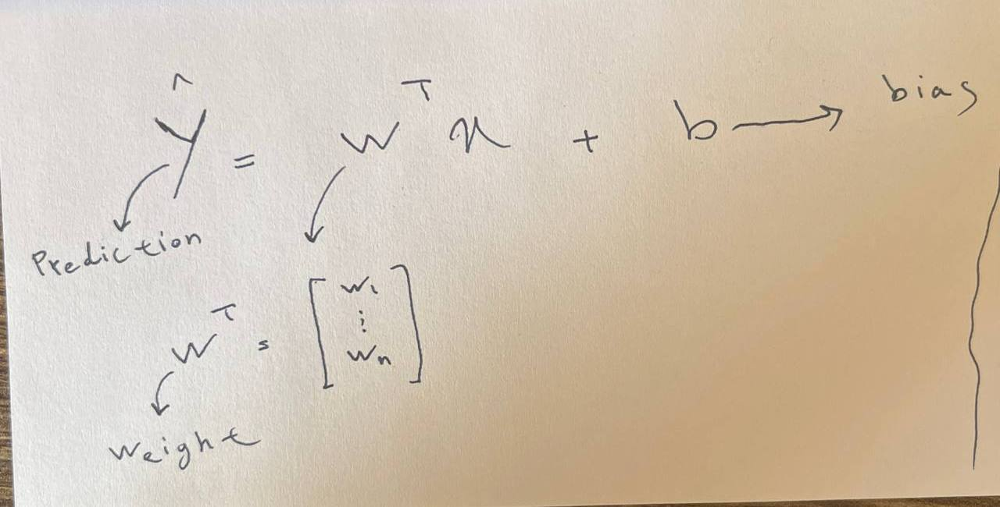

---

### Mean Squared Error Cost Function

Used to measure the error between predictions and actual values.

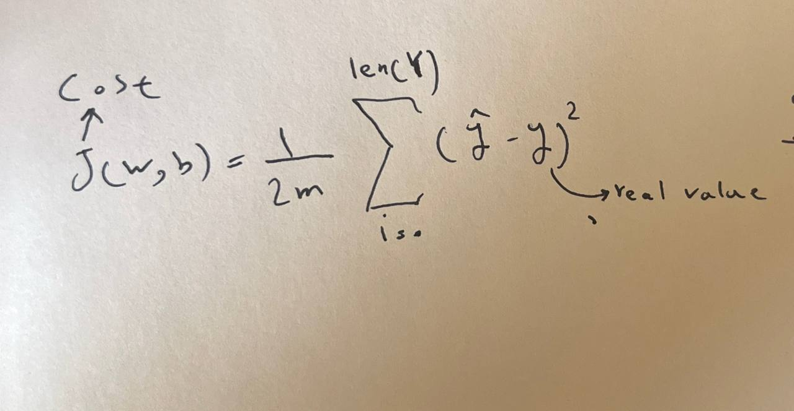

---

### Gradient Descent

Optimization algorithm used to minimize the cost function.
By using gradient we could reach local minima of a function as you you can see in the graph!

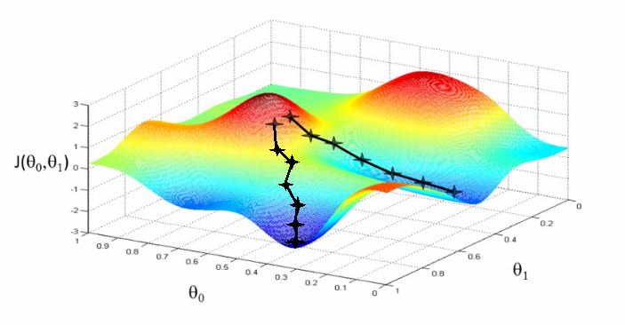
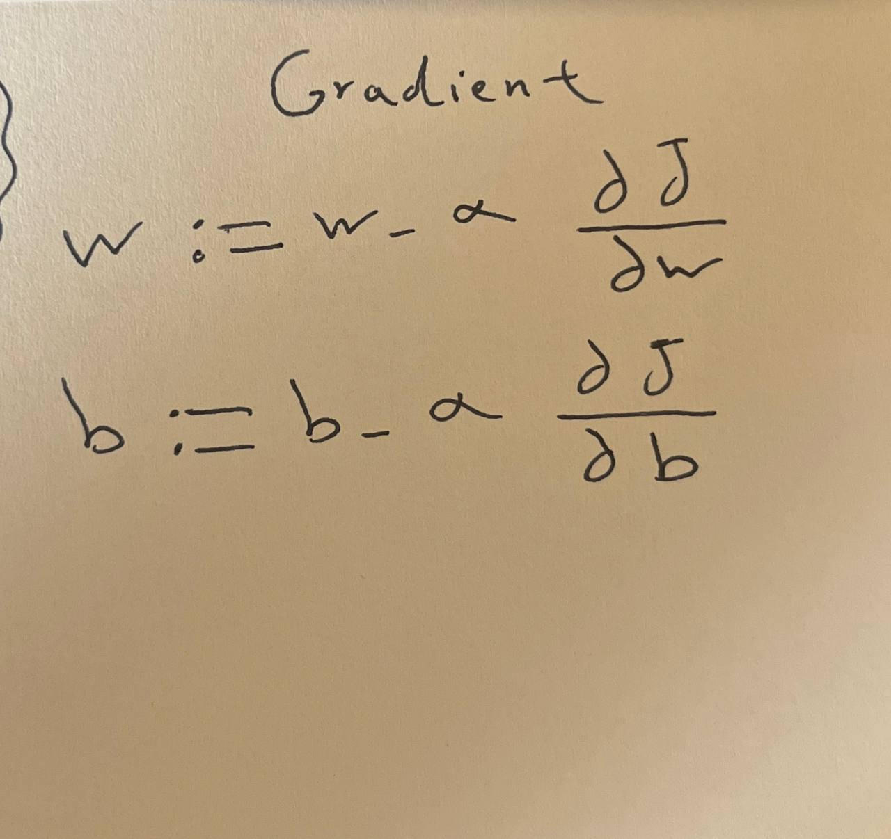

---

### Logistic Regression & Sigmoid Function
One of main reason to use sigmoid is to convert from linearity to non-linearity functions 
Transforms linear outputs into probabilities for binary classification.

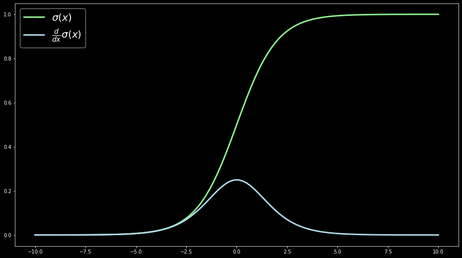
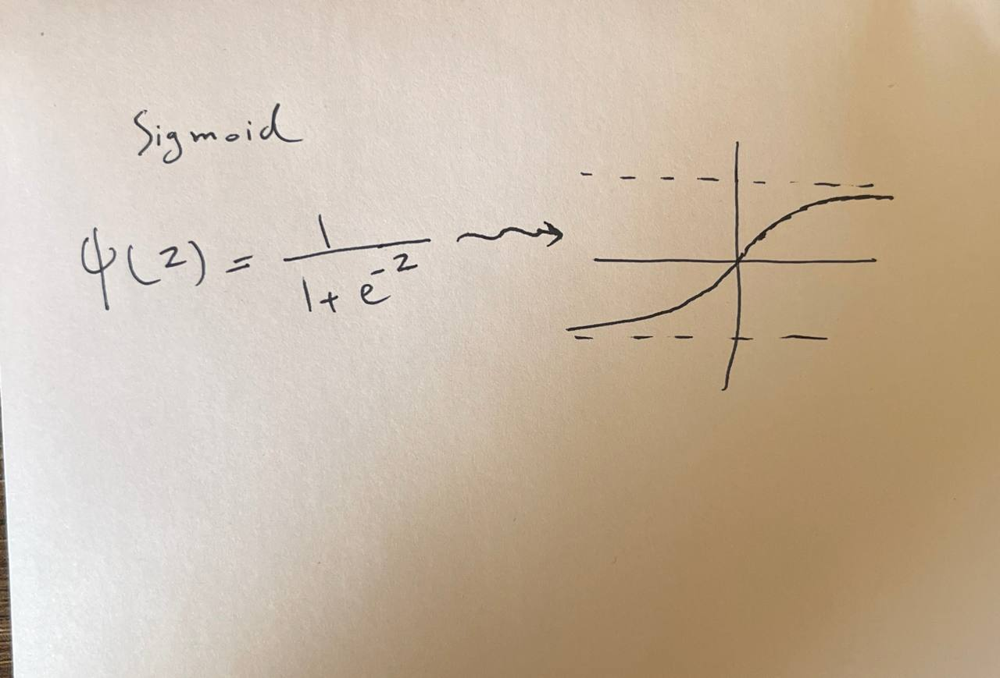

---

## Project Structure

```text
Machine-Learning-From-Scratch/
│
├── Linear-Models/
│   ├── Models.py
│   └── examples.py
│
└── math.md
```

---

## Training Results

### Cost Function Convergence

The cost decreases during training as Gradient Descent approaches the optimal parameters.
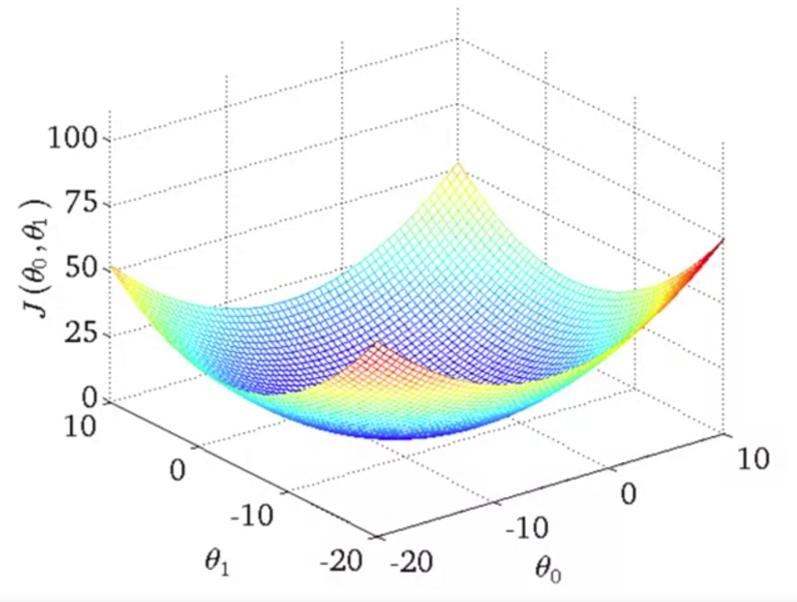

---

### Linear Regression Predictions

Comparison between actual values and model predictions.

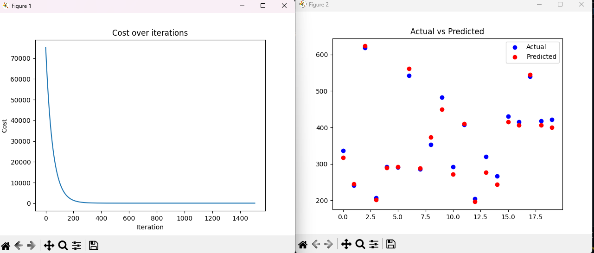
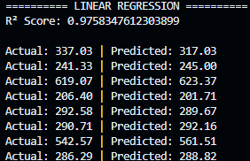

---
## Logistic Regression Predictions

Comparison between actual values and model predictions.

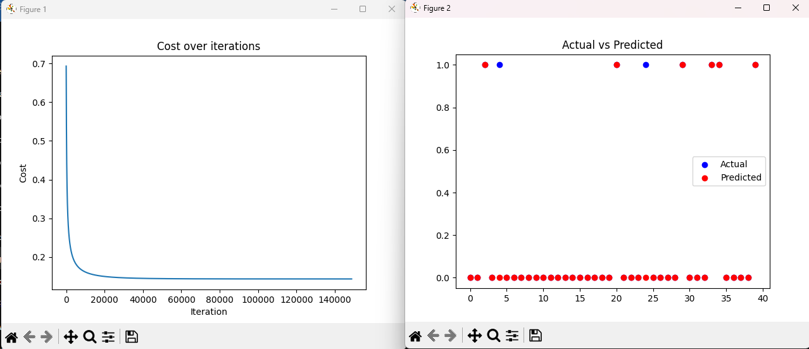
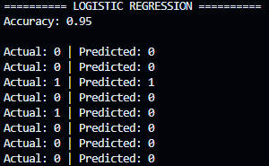
---

## Implemented Features

### Linear Regression Class

* fit()
* predict()
* score()
* Graph()
* train/test split
* feature normalization

### Logistic Regression Class

* fit()
* predict_prob()
* predict()
* score()
* Graph()
* train/test split
* feature normalization

---

## What I Learned

Through this project I explored:

* Linear Algebra in machine learning
* Cost functions
* Gradient Descent optimization
* Feature scaling
* Regression
* Classification
* Model evaluation metrics
* Mathematical implementation of machine learning algorithms

---

## Future Improvements

* Polynomial Regression
* Regularization (L1 / L2)
* Softmax Regression
* Confusion Matrix
* Precision & Recall Metrics
* K-Fold Cross Validation

---

> Understanding the mathematics behind machine learning is the first step toward building reliable AI systems.
